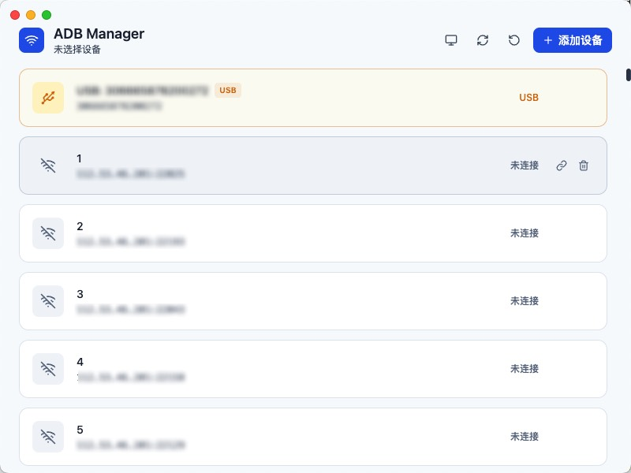
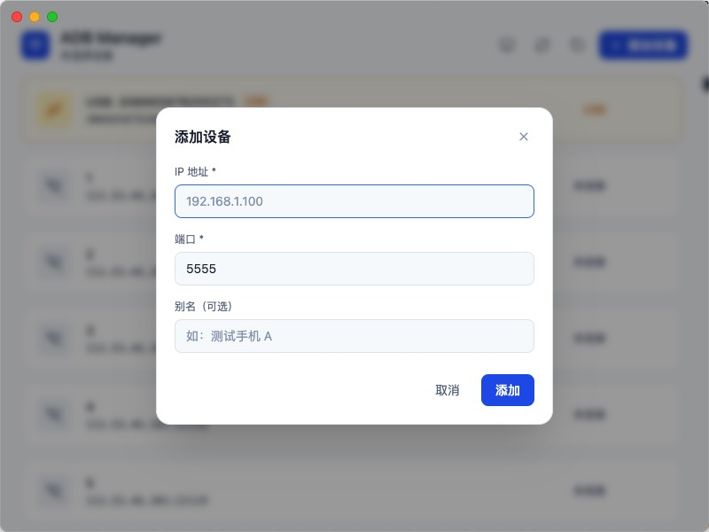
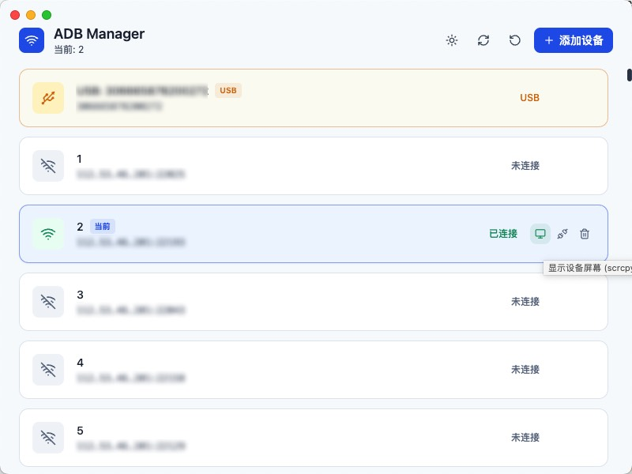

# ADB Manager

跨平台 ADB 连接管理器。支持 macOS / Windows / Linux。

## 核心功能

- 添加、删除 ADB 连接信息（IP + 端口 + 别名）
- 点击切换活跃设备（自动断开旧设备 → 连接新设备）
- 实时显示连接状态
- 配置持久化到本地 JSON 文件


## 预览


主界面 - 设备列表管理


添加设备对话框


支持Scrcpy屏幕镜像

## 架构

```
src/
├── core/                  ← 框架无关的核心逻辑（可复用到 TUI / Flutter）
│   ├── types.ts           共享类型定义
│   ├── adb-executor.ts    ADB 命令执行器（接口 + 实现）
│   ├── config-store.ts    配置持久化（接口 + 实现）
│   ├── device-manager.ts  设备管理业务逻辑
│   └── index.ts           对外导出
├── main/                  ← Electron 主进程
│   ├── index.ts           窗口管理 + 生命周期
│   ├── ipc-handlers.ts    IPC 桥接层
│   └── preload.ts         安全 API 注入
└── renderer/              ← React UI
    ├── App.tsx
    ├── components/
    │   ├── DeviceCard.tsx
    │   ├── AddDeviceDialog.tsx
    │   └── Toast.tsx
    ├── global.d.ts
    └── styles/globals.css
```

### 分层设计

核心层 `core/` 仅依赖 Node.js 内置模块，通过接口解耦：

- **IAdbExecutor** — ADB 命令执行接口，其他平台用 Go/Dart/Swift 重新实现
- **IConfigStore** — 配置存储接口，其他平台可用 SharedPreferences / NSUserDefaults
- **DeviceManager** — 依赖上述两个接口，包含切换/状态管理等全部业务逻辑

换 TUI 或 Flutter 时，只需：
1. 复制 `core/` 并用目标语言实现 `IAdbExecutor` + `IConfigStore`
2. 重写 UI 层调用 `DeviceManager` 的公开 API

## 开发

```bash
npm install
npm run dev          # 同时启动 Vite + Electron（开发模式）
```

## 构建

```bash
npm run build        # 编译 TypeScript + 构建 Vite
npm run pack         # 打包为平台安装包
```

## 配置文件位置

`~/.config/adb-manager/config.json`
